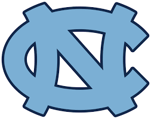

# Academic Portfolio

## Education

**The University of North Carolina at Chapel Hill (_May 2027_)**

B.S., Statistics & Analytics | B.A., Economics | Data Science Minor

## Relevant Coursework

**STOR 235 &ndash; Mathematics for Data Science**

A course focused on matrix algebra and multivariable calculus, with weekly labs done in **Python** to gain an understanding of the use and applications of mathematical concepts in programming. Lab topics covered machine learning and optimization topics, including support vector machines, principal component analysis, and neural networks.

**STOR 320 &ndash; Introduction to Data Science**

A course providing comprehensive instruction in **R** and RStudio, with a focus on the full data analytics pipeline. Emphasis was placed on data acquisition, cleaning, transformation, exploratory analysis, and visualization. The course also covered principles of model building and evaluation, such as cross-validation and sensitivity/specificity, alongside best practices for communicating results effectively.

**STOR 455 &ndash; Methods of Data Analysis**

A course in **R** and RStudio focused on comparing statistical approaches for data analysis. Topics included simple and multiple linear regression, hypothesis testing, ANOVA, and nested F-tests. The course also explored strategies for identifying optimal models using criteria such as AIC and BIC, as well as variable selection techniques such as stepwise selection. 

## Projects

**Exploring Recency Bias and Outcome Prediction in UFC Fights &ndash; STOR 320**

[Read the Report](docs/Final_paper_submission-2.html)

This project explored potential recency bias in UFC decision judging and used predictive modeling to identify key indicators of fight outcomes. Working in a five person group, we replicated the full data analytics cycle using **R** and RStudio and worked with 10 years of real world UFC fight data. Our analysis found no evidence that judges favor later rounds, and identified strike location as the strongest predictor of winners among different striking categories. This analysis can be used to help structure fighter strategies and improve judging transparency.

  

